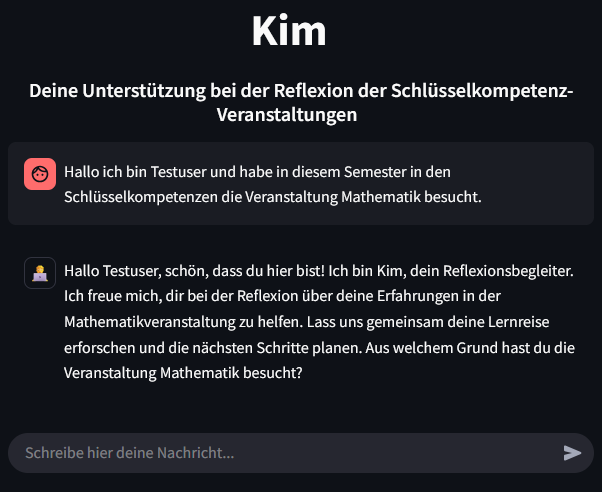

# KIM Chatbot

This is the repository for the KIM Chatbot, an LLM-driven asisstant for the reflection of study subjects. It was developed as part of the project "KI-Coach – Ein digitaler Reflexionshelfer für Studierende" in cooperation with the IAAI at HdM from 2024-2025. The project was financed by the Stifterverband and the Ministry of Science, Research and Arts Baden-Württemberg as part of the program [Fellowships für Innovationen in der digitalen Lehre Baden-Württemberg](https://www.stifterverband.org/bwdigifellows).

For details see the [project description](https://www.stifterverband.org/bwdigifellows/2024_seidl_pfeffer).

<p align="center">
  
</p>

## Key Features
* Interaction for reflective discussion in natural language.
* New models or new/adjusted sysprompts can be configured.
* Easy setup within docker.


## Installation & Setup

The KIM-Chatbot can be run either by using the (1) image from dockerhub, (2) building the docker image locally from scratch or (3) running the application straight via Python.

### (1) Using the docker image from dockerhub (recommended)

1. If you haven't already, install [Docker](https://docs.docker.com/desktop/).
2. Pull the image from dockerhub: ``docker pull frupp/llm-chatbot`` .
3. Create a directory where chats should be saved.
4. Run and create a container: ``docker run -d -p 8501:8501 --name llm-chatbot -v <path-to-save-dir>:/llm-chatbot/data frupp/llm-chatbot`` .
5. The KIM Chatbot will then be available at localhost:8501 .

### (2) Building the docker image locally

1. If you haven't already, install [Docker](https://docs.docker.com/desktop/).
2. Navigate to the ``code/`` directory and run: ``docker build -t llm-chatbot:latest`` .
3. Create a directory where chats should be saved.
4. Run and create a container: ``docker run -d -p 8501:8501 --name llm-chatbot -v <path-to-save-dir>:/llm-chatbot/data llm-chatbot`` .
5. The KIM Chatbot will then be available at localhost:8501 .

### (3) Running the application with Python directly

1. Install Python $\ge$ 3.11 .
2. Navigate to ``code/`` .
3. Install additionally required modules via: ``pip install -r requirements.txt`` .
4. Create the following environment variables:
```
ENV CHAT_PATH=data/chat
ENV ENDPOINTS_CONFIG=data/endpoints.json 
ENV MODELS_CONFIG=data/models.json
ENV GUI_CONFIG=data/gui_config.json
ENV DATABASE_PATH=data/chatbot.db
ENV TIME_LIMIT_DELTA_SECONDS=60
ENV RATE_LIMIT_FRACTION_LEFT=0.3
```
5. Run ``streamlit run main.py``


## Customization
The KIM Chatbot can be customized in terms of API endpoints for serving language models and configuring models via system prompts for instance.

### Creating new models
New models can be created by entering the admin mode by adding the get parameter ``auth=banana`` to the URL, for instance ``http://localhost:8501?auth=banana``.

After name and subject have been entered, the admin panel will then appear on the second page on the right. Models can be created there. For model creation the following must be provided:
* select the endpoint where the model is served
* select an available model from the endpoint
* a system prompt for the model
* a summary prompt (optional)

Configured models are then saved persistently in the ``code/models.json`` file.


### Endpoints
At the moment, two enpoints are implemented:
* [Academic Cloud](https://academiccloud.de/services/chatai/)
* [Ollama](https://ollama.com/)

New endpoints can be defined in the module ``code/endpoints.py`` by creating a class that implements the abstract baseclass ``Endpoint``. This approach requires endpoint classes to implement the methods:
* ``chat(messages, model:str, temperature:float, top_p:float)``: is used to interact with a language model served by the endpoint. It returns an iterator returning the tokens from the language model. The parameters are:
  * ``messages``: A list with the potential existing messages in the conversation.
  * ``model``: a string identifying the model defined in models.json (see below).
  * ``temperature``: optional, adjusts the temperature for the LLM in $[0,1]$. It controls the influence of randomness of a model's output. The higher the more random.
  * ``top_p``: optional, adjusts the diversity for the LLM in $[0,1]$. Defines the percentage of top tokens considered. The higher the more variation.
* ``model_list``: returns a list of all configured models for this endpoint.

In addition, endpoints must be configured in the ``code/endpoints.json`` file in the form:

```
[
  {
    "name": "<endpoint name>",
    "endpoint": "https://url-to-endpoint",
    "type": "openai|ollama",
    "api_key": "<api-key>"
  }
]
```


## Code
The code can be found in ``code/``. We will soon provide a more detailed documentation of the code and its modules here.
